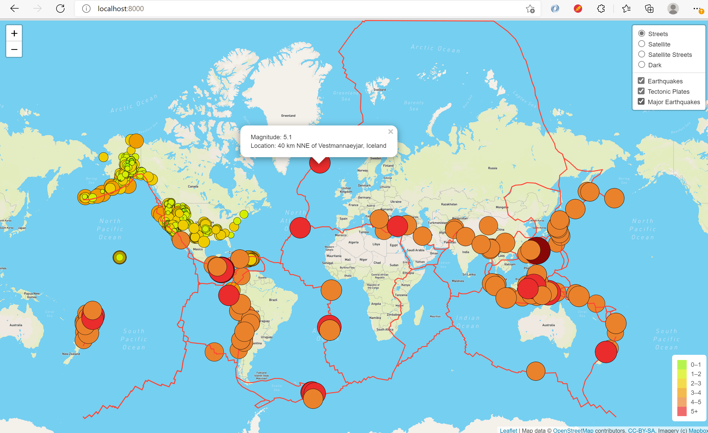

# Mapping Earthquakes

## Purpose :
The purpose of this analysis is to retrieve latest GeoJSON earthquake data of last 7 days and tectonic plate data from the U.S. Geological Survey website in order to populate a geographical map for a better understanding of areas having earthquakes and areas that are at a high risk of future earthquakes.
This map will help build insightful data visualizations with interactive features on earthquakes around the world. 

## Basic Project plan
The earthquake data will be retrieved using tools such as JavaScript and D3 and Leaflet libraries and plot the data on a Mapbox map through an API request.

 

## Results :
The Map can be displayed in many different styles of maps like street, satellite, satellite street and dark just at the toggle of a button. 
Also the map has three different data highlighted on it, which is Earthquake data with markers, tectonic plate data and major earthquake data.  Will look into the data shown by all of these separately below:

### Map with Earthquake data : 
In this selection, the locations where there was an earthquake recorded in the last 7 days has been highlighted with a circle popup marker. On clicking at the circular markers, a popup opens with the datails about the magnitude of earthquake along with the location of the earthquake. Also the color of the marker changes as per the intensity of the magnitude of earthquake. The color has been specified in the form of a range of the magnitude of earthquake. A detailed explanation of the colors is given on the map at the right hand corner of the map in a legend. 

 

### Map with Tectonic plates data :
On selecting tectonic plates, the javascript file retrieves the data from the JSON file link defined in the callback function. It retrieves the data of the tectonic plate coordinates from geojson link (https://earthquake.usgs.gov/earthquakes/feed/v1.0/summary/4.5_week.geojson) and displays it in the form of a dark orange colored linestring.

 
### Map with Major Earthquake data :
Locations with major earthquakes of the magnitude range of 5 to 6 and 6 and above and everything else under the magnitude of 5, get highlighted on selection of this option.
In order to easily identify the locations of earthquake magnitude of 6 and above, a darker color is used for the circular popup markers.

 
Apart from the above there are different styles to select from street, satellite, satellite street and dark.

## Conclusion :
The magnitude of an earthquake describes its size. There is only one magnitude for each earthquake. Scientists also talk about the intensity of shaking from an earthquake, and this varies depending on where you are during the earthquake.

The magnitude of an earthquake depends on the size of the fault and how far the plates move. Hence knowing the lines of the tectonic plate is really helpful for the scientist and earthquake disaster team to be extra alert in these areas.

The purpose of the Earthquake Advisory issued by the Earthquake disaster team is to provide scientific information to emergency managers and the public for low-probability, high-consequence events and serve as the basis for recommended preparedness and mitigation actions by emergency management officials to those communities in the areas of concern. 

Specifically, the Advisory intends to inform the public to consider actions such as: build a preparedness kit; review communication and emergency disaster plans; and practice the “Drop, Cover and Hold On” drill.

The Advisory also encourages local government to publish disaster readiness information, revisit local emergency plans and check supplies and test equipment.
Earthquakes remain unpredictable, even following a potential foreshock, an event is still improbable. Earthquake advisories can only provide emergency managers and the public with uncertain scientific information, but that information can still mitigate the impacts of a potential major earthquake.

Future projects : Following future projects can help analyze the data further :

Creating a interactive webpage linked to a javascript file that can retrieve data about : 
   
   a. The top 10 cities with the highest magnitude of earthquake. 
   
   b. Details about the current population of that city 
   
   c. Damage in terms of dollars caused due to the earthquake. 

   d. Estimation of damage from future earthquakes based on certain calculations adding inflation.
   
   This can immensely help plan some safety measures in these affected areas.

Ref : https://www.caloes.ca.gov/cal-oes-divisions/earthquake-tsunami-volcano-programs/earthquake-advisory

